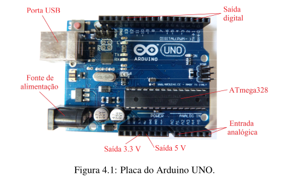
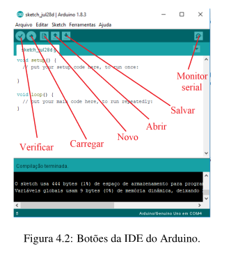

## Meu primeiro código em C com lib do arduino

```cpp
// Primeiro Código!

void setup() {
  pinMode(13, OUTPUT); // pinMode(porta, action) - Nesse caso estamos habilitando a PORTA 13 para saída de tensão

}

// Função LOOP executa o que está dentro dela infitamente.
void loop() {
  // digitalWrite(porta, voltagem) HIGH = 5V / LOW = 0V
  digitalWrite(13, HIGH);
  // delay(n) força uma pausa de n milissegundos na execução das linhas de comando.
  delay(1000);
  digitalWrite(13, LOW);
  delay(1000);
// Sem o delay(1000) para dar a pausa o led iria ficar alternando em 5V e 0V em uma
// velocidade tão rápida que nem iamos conseguir ver
}

/*
Finalizando cógido, esse passa uma instrução para um
led ligar e desligar de 1 em 1 seg.

*/
```

## Arduino UNO.

Muito usado para quem está iniciando.



### **Microcontrolador ATmega328.**

É o cérebro da placa, onde todo o processamento de dados é feito. Ele é basicamente uma CPU com clock de 20 MHz, 8 bits e 32 kB de memória flash. Além disso, é nesse controlador que os programas são armazenados.

### **Porta USB.**

É por onde a comunicação com o computador é feita, e que também serve como fonte de alimentação da placa.

### Fonte de alimentação.

Usada quando desejamos operar a placa sem um computador. Naturalmente, um computador é necessário em um primeiro momento para colocar o programa dentro da placa.

### Pinos.

Essa placa possui uma série de pinos, que podem servir tanto para entrada e saída de dados como também como uma fonte de tensão fixa.

**Os pinos numerados como A0, A1, A2, A3, A4 e A5 são de entrada analógica.**

**Os pinos denotados por GND são o terra e os pinos de 1 a 13 são para saı́da da tensão.**

Desses, alguns possuem também o símbolo ∼, que representam uma saída do tipo PWM (modulação por largura de pulso), que seria uma forma de simular uma saı́da analógica.

### IDE Arduino


